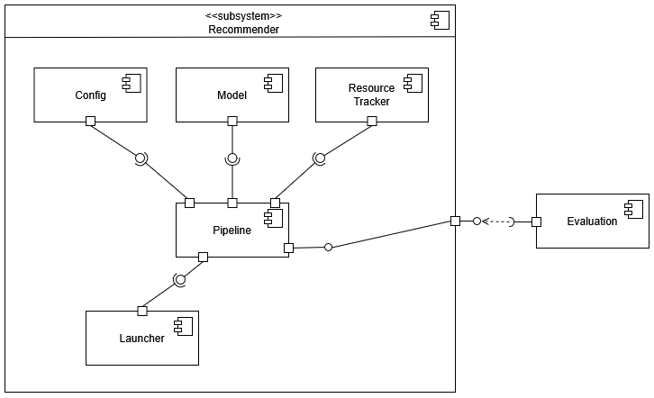
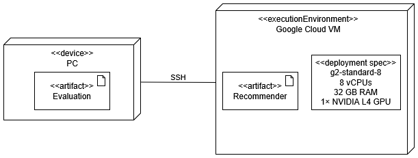
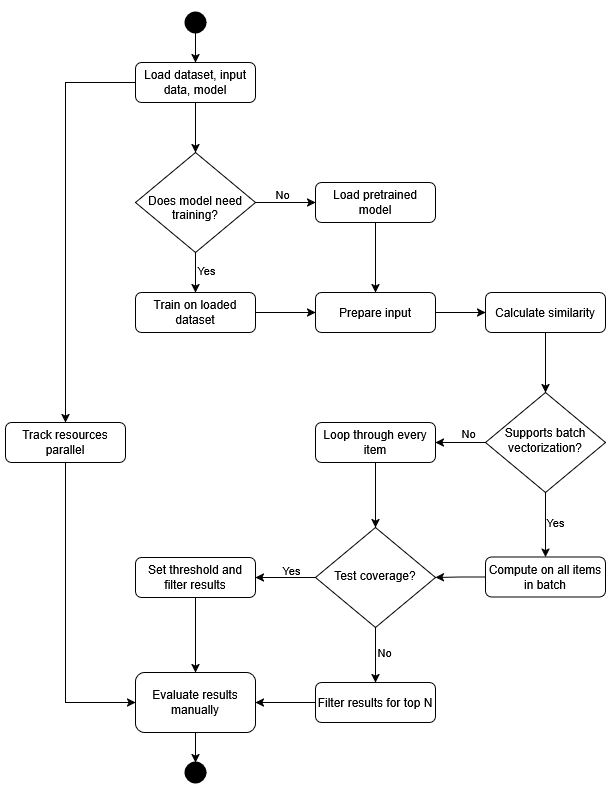

# Evaluating_Recommender_Systems_Implementation
System to evaluate and compare multiple text-based recommendation algorithms using book descriptions and paragraphs. Generating recommendations for book paragraphs or descriptions, and evaluating their results.


## Technical Documentation

### Setup:

#### Development Environment:

- **Visual Studio Code**  

#### Try out the system:
- **Open the repository in Visual Studio Code**
- **Create a virtual environment** (recommended)

    - **For macOS/Linux:**
        ```bash
        python3 -m venv venv
        source venv/bin/activate
        ```
    - **For Windows:**
        ```bash
        python -m venv venv
        venv\Scripts\activate
        ```

- **Install requirements**
    ```bash
    pip install -r requirements.txt
    ```

  - used language: **Python 3.10.6**  
  - used libraries and tools:  
    - `pandas` – for structured data manipulation using DataFrames  
    - `numpy` – for efficient numerical computations and array handling  
    - `psutil` – to monitor CPU and memory usage during algorithm execution  
    - `GPUtil` – to monitor GPU usage during embedding generation and inference  
    - `time` – for measuring execution time and performance metrics  
    - `os` – for file handling, path management, and process ID access  
    - `tqdm` – to display progress bars for loops and slow operations  
    - `joblib` – for parallelizing tasks like similarity calculations across cores  
    - `multiprocessing` – to enable parallel CPU/GPU/Memory resource tracking  
    - `scikit-learn` – used for:  
      - `cosine_similarity` – to compute vector similarity between documents  
      - `TfidfVectorizer` – to transform text into TF-IDF vectors  
      - `CountVectorizer` – to generate Bag-of-Words representations  
      - `TruncatedSVD` – for Latent Semantic Analysis (dimensionality reduction)  
    - `gensim` – for training and using FastText embeddings on custom datasets  
    - `sentence-transformers` – for generating contextual embeddings with Sentence-BERT  
    - `torch` – for GPU-based tensor operations and cosine similarity computation in BERT-based models  


- **Run example:**
    ```bash
    python3 -m run_algorithms.run_tfidf
    ```

### Project Structure:

```
src/
│
├── config/                   # Configuration settings
│   └── base_config.py
├── core/                     # Core pipeline logic for model execution
│   └── pipeline.py
│
├── models/                   # Modular implementation of recommendation models
│   ├── base_model.py         # BaseRecommender class
│   ├── tfidf_model.py        
│   ├── bow_model.py          
│   ├── fasttext_model.py     
│   ├── glove_model.py        
│   ├── lsa_model.py          
│   ├── bert_model.py
|   └── e5_model.py        
│
├── resource_tracking/        # Resource usage monitoring (memory, CPU, GPU)
│   └── resource_tracker.py
│
├── results/                  # Output folder for all results and tracking
│
├── run_algorithms/           # Entry points for running each individual model
│   ├── run_tfidf.py
│   ├── run_bow.py
│   ├── ...
│
├── saved_models/             # Saved model files (e.g., GloVe vectors)
│
├── evaluation.ipynb          # Jupyter Notebook for manual evaluation
└── implementation.ipynb      # Jupyter Notebook for dataset preparation and development
```
- the implementation notebook was used for preparing the dataset of book paragraphs and for developing the logic of recommendations and tracking
- the final system is restructured to be able to run models separately and to support further development, integration of additional models, and expansion with more datasets 
- some models have been added later to the new structure (e.g., E5)
---


### Components and Deployment


<br>
- **Google Cloud - Virtual Machine**  
All experiments were executed on a Google Cloud virtual machine (`g2-standard-8`) with **8 vCPUs**, **32 GB RAM**, and **1× NVIDIA L4 GPU**. The VM environment allowed for efficient GPU-accelerated model execution and clean, uninterrupted **resource tracking** without relying on local hardware. This setup ensured reproducibility and enabled long-running experiments remotely.


---

### Models used:  
- TF-IDF - Term Frequency–Inverse Document Frequency
  - TfidfVectorizer(stop_words="english", max_features=5000) 
- LSA - Latent Semantic Analysis
  - TfidfVectorizer(stop_words="english", max_features=5000) 
  - TruncatedSVD(n_components=500, random_state=42)
- BoW - Bag of Words
  - CountVectorizer(stop_words="english") 
- FastText - Facebook's FastText Word Embeddings
  - FastText(vector_size=100, window=5, min_count=2, workers=4, epochs=20) 
- GloVe - Global Vectors for Word Representation
  - Pretrained 50-dimensional embeddings were used from the [GloVe project](https://nlp.stanford.edu/projects/glove/) trained on 6B tokens from Wikipedia and Gigaword. - to use, add it to saved_models - glove.6B.50d.txt
- BERT - Bidirectional Encoder Representations from SentenceTransformers
  - SentenceTransformer("all-MiniLM-L6-v2") 
- E5 - Embedding-based Encoder for Information Retrieval from SentenceTransformers
  - SentenceTransformer("intfloat/e5-base")


### Examples of used datasets:
Book Descriptions  
<br><br>
Book Paragraphs  
<br>


---

### How It Works - Step-by-Step:

1. **Configuration**
   - Uses `base_config.py` to select:
     - Dataset path
     - Recommendation type (paragraph or description)
     - Algorithm name
     - Input index pairs

2. **Model Training**
   - Each model defines its own `.train(data)` method.

3. **Input Preparation**
   - Based on config, it prepares input vector and document matrix for comparison.
   - Paragraphs or full book descriptions are used.

4. **Similarity Calculation**
   - Cosine similarity is calculated using either:
     - Matrix-based vectorization (e.g., TF-IDF)
     - Word embeddings (e.g., GloVe, FastText)
   - Uses optimized paths:
     - Batch vectorized `cosine_similarity(...).flatten()` for some
     - Loop-based `compute_similarity(...)` for others

5. **Filtering & Recommendation**
   - Based on similarity threshold × max(similarity)
   - Top-N recommendations returned

6. **Resource Tracking**
   - Parallel memory/CPU/GPU monitoring using `multiprocessing`
   - Data saved in `results/results_for_<type>/[cpu|memory|gpu]_tracking/...`

7. **Results**
   - Recommendations saved per run (`*_results_<book>_<para>.csv`)
   - Performance saved per run (`*_summary.csv`)
   - Training time logged in `training_times.csv`

Here is the flow of the system: 

---

### Evaluation and Visualization
Results were evaluated manually in the `evaluation.ipynb` Jupyter notebook.

The notebook focuses on both **quantitative** and **visual** evaluation of recommendation performance using a variety of metrics:

- **Core evaluation metrics**:
  - *Coverage* 
  - *Confidence*
  - *Similarity*
  - *Diversity - variance*
  - *Diversity - dissimilarity*
  - *Popularity*
  - *Novelty*
  - *Execution Speed*
  - *Resource Usage (CPU, GPU, Memory)*
  
- **Evaluation on results Metadata**:
  - Goodreads dataset was used to see each models recommendations ratings (ratings, reviews, genres) 

- **Visualization**:
  - Radar plots to compare multi-metric performance across models

All evaluations were computed post-execution using the saved recommendation outputs and tracked performance logs from the virtual machine.


---
### Further Development:
#### Adding more Datasets:
To extend the system with a new dataset:

1. **Prepare the Dataset in similar format as the paragraphs or descriptions**  

2. **Add the new Dataset to `datasets/new_data.csv`** 

3. **Update `config/base_config.py` for the new dataset path** 


#### Adding more Models: 
To extend the system with a new text representation model, follow these steps:

1. **Create a new model class**  
   - File: `src/models/new_model.py` (Inherit from `BaseRecommender`)

2. **Implement required methods**  
   - `train(data)`  
   - `get_input_vector()`  
   - `get_doc_vectors()`  
   - `compute_similarity(...)` or `compute_all_similarities(...)`  
   - `format_recommendation(...)`

3. **Add a run script**  
   - File: `src/run_algorithms/run_new_model.py`  

4. **Configure model settings**  
   - Edit `config/base_config.py`  
   - Set your algorithm name, dataset path, and threshold if needed

5. **Run new model**  
   ```bash
   python3 -m run_algorithms.run_new_model
    ```

---

### Models for Future Implementation:  

- T5 (sentence-t5-base) - text-to-text 

- LaBSE (BERT variant) - multilingual 

- Universal Sentence Encoder (USE) - transformer (tensorFlow)
