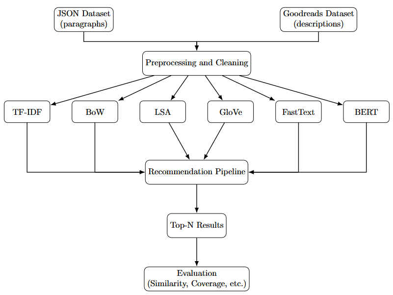
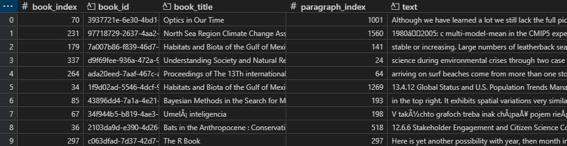

# Evaluating_Recommender_Systems_Implementation
System to evaluate and compare multiple text-based recommendation algorithms using book descriptions and paragraphs. Generating recommendations for book paragraphs or descriptions, and evaluating their results.


## Technical Documentation
- **Google Cloud - Virtual Machine**  
All experiments were executed on a Google Cloud virtual machine (`g2-standard-8`) with **8 vCPUs**, **32 GB RAM**, and **1× NVIDIA L4 GPU**. The VM environment allowed for efficient GPU-accelerated model execution and clean, uninterrupted **resource tracking** without relying on local hardware. This setup ensured reproducibility and enabled long-running experiments remotely.

### Setup:

#### Development Environment:

- **Visual Studio Code**  

#### Try out the system:
- **Open the repository in Visual Studio Code**
- **Create a virtual environment** (recommended)

    - **For macOS/Linux:**
        ```bash
        python3 -m venv venv
        source venv/bin/activate
        ```
    - **For Windows:**
        ```bash
        python -m venv venv
        venv\Scripts\activate
        ```

- **Install requirements**
    ```bash
    pip install -r requirements.txt
    ```

  - used language: **Python 3.10.6**  
  - used libraries and tools:  
    - `pandas`  
    - `numpy`  
    - `psutil`  
    - `GPUtil`  
    - `time`  
    - `os`  
    - `tqdm`  
    - `joblib`  
    - `multiprocessing`  
    - `scikit-learn` *(for `cosine_similarity`, `TfidfVectorizer`, `CountVectorizer`, `TruncatedSVD`)*  
    - `gensim` *(for `FastText`)*  
    - `sentence-transformers` *(for `SentenceTransformer`)*  
    - `torch` 

- **Run example:**
    ```bash
    python3 -m run_algorithms.run_tfidf
    ```

### Project Structure:

```
src/
│
├── config/                   # Configuration settings
│   └── base_config.py
├── core/                     # Core pipeline logic for model execution
│   └── pipeline.py
│
├── models/                   # Modular implementation of recommendation models
│   ├── base_model.py         # BaseRecommender class
│   ├── tfidf_model.py        
│   ├── bow_model.py          
│   ├── fasttext_model.py     
│   ├── glove_model.py        
│   ├── lsa_model.py          
│   └── bert_model.py         
│
├── resource_tracking/        # Resource usage monitoring (memory, CPU, GPU)
│   └── resource_tracker.py
│
├── results/                  # Output folder for all results and tracking
│
├── run_algorithms/           # Entry points for running each individual model
│   ├── run_tfidf.py
│   ├── run_bow.py
│   ├── ...
│
├── saved_models/             # Serialized model files (e.g., GloVe vectors)
│
├── evaluation.ipynb          # Jupyter Notebook for manual evaluation
└── implementation.ipynb      # Implementation details and experimentation
```

---


### Deployment
<br>


---
### Conceptual Proposal


---

### Models used:  
- TF-IDF (Term Frequency–Inverse Document Frequency)
- LSA (Latent Semantic Analysis)
- BoW (Bag of Words)
- FastText (Facebook's FastText Word Embeddings)
- GloVe (Global Vectors for Word Representation)
- BERT (Bidirectional Encoder Representations from Transformers - Sentence-BERT variant)


### Datasets used:
Book Descriptions - `datasets/book_details_clean.csv`<br>  
<br><br>
Book Paragraphs - `datasets/paragraphs_limited_to_200_quarter.csv`<br>  
<br>


---

### How It Works - Step-by-Step:

1. **Configuration**
   - Uses `base_config.py` to select:
     - Dataset path
     - Recommendation type (paragraph or description)
     - Algorithm name
     - Input index pairs

2. **Model Training**
   - Each model defines its own `.train(data)` method.

3. **Input Preparation**
   - Based on config, it prepares input vector and document matrix for comparison.
   - Paragraphs or full book descriptions are used.

4. **Similarity Calculation**
   - Cosine similarity is calculated using either:
     - Matrix-based vectorization (e.g., TF-IDF)
     - Word embeddings (e.g., GloVe, FastText)
   - Uses optimized paths:
     - Batch vectorized `cosine_similarity(...).flatten()` for some
     - Loop-based `compute_similarity(...)` for others

5. **Filtering & Recommendation**
   - Based on similarity threshold × max(similarity)
   - Top-N recommendations returned

6. **Resource Tracking**
   - Parallel memory/CPU/GPU monitoring using `multiprocessing`
   - Data saved in `results/results_for_<type>/[cpu|memory|gpu]_tracking/...`

7. **Results**
   - Recommendations saved per run (`*_results_<book>_<para>.csv`)
   - Performance saved per run (`*_summary.csv`)
   - Training time logged in `training_times.csv`

---

### Evaluation
Results were evaluated manually in the `evaluation.ipynb` jupyter notebook


---
### Further Development:
#### Adding more Datasets:
To extend the system with a new dataset:

1. **Prepare the Dataset in similar format as the paragraphs or descriptions**  

2. **Add the new Dataset to `datasets/new_data.csv`** 

3. **Update `config/base_config.py` for the new dataset path** 


#### Adding more Models: 
To extend the system with a new text representation model, follow these steps:

1. **Create a new model class**  
   - File: `src/models/new_model.py` (Inherit from `BaseRecommender`)

2. **Implement required methods**  
   - `train(data)`  
   - `get_input_vector()`  
   - `get_doc_vectors()`  
   - `compute_similarity(...)` or `compute_all_similarities(...)`  
   - `format_recommendation(...)`

3. **Add a run script**  
   - File: `src/run_algorithms/run_new_model.py`  

4. **Configure model settings**  
   - Edit `config/base_config.py`  
   - Set your algorithm name, dataset path, and threshold if needed

5. **Run your model**  
   ```bash
   python3 -m run_algorithms.run_new_model
    ```

---

### Models for Future Implementation:  
- E5 (intfloat/e5-base, e5-mistral) | Transformer | Retrieval, similarity, question answering

- GTR (T5 for retrieval) | T5 Encoder | Dense retrieval, semantic search

- MPNet (all-mpnet-base-v2) | Transformer | Text similarity, clustering

- MiniLM (all-MiniLM-L6-v2) | Lightweight BERT | Fast inference, general embeddings 

- T5 (sentence-t5-base) | Text-to-text | General-purpose understanding

- LaBSE | BERT variant | Multilingual semantic similarity

- Universal Sentence Encoder (USE) | Transformer (TensorFlow) | Semantic similarity, clustering

- Contriever | Transformer (unsupervised) | General retrieval
